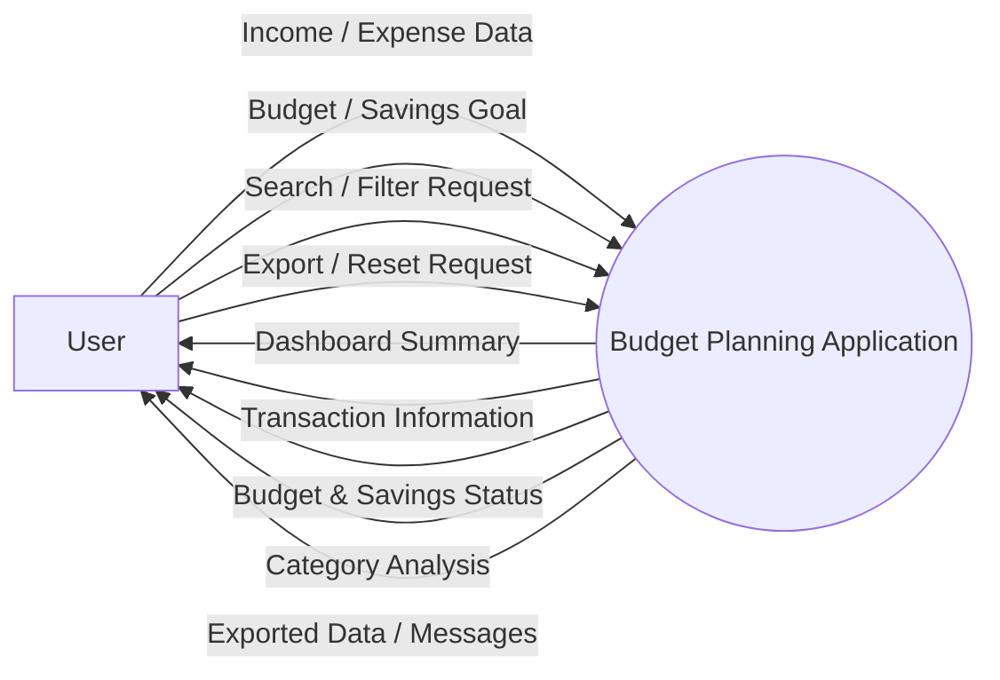
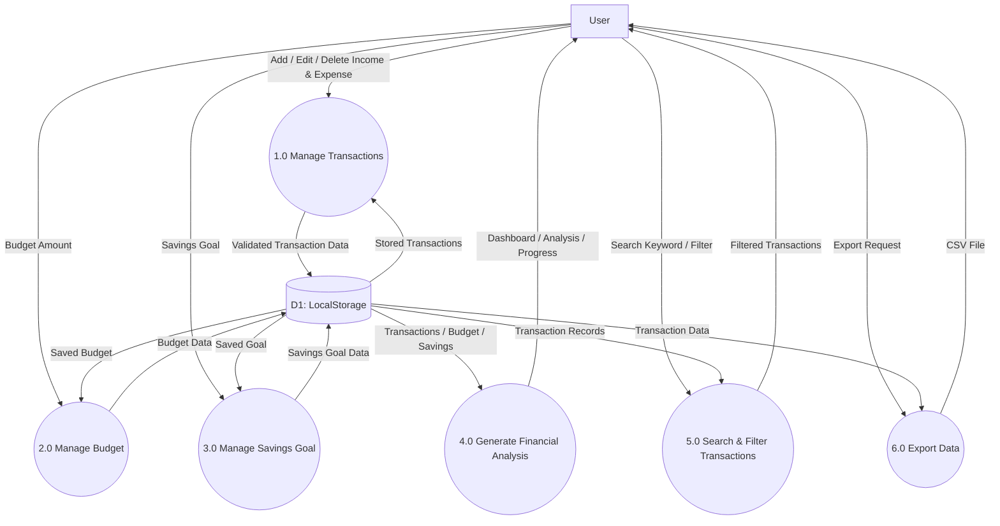

# Data Flow Diagram (DFD) — Budget Planning Application

**Project Name:** Budget Planning Application  
**Document:** Data Flow Diagram  
**Author:** Ansh Pandey  
**Year:** 2026  
**Technology:** HTML5, CSS3, JavaScript ES6, Browser LocalStorage  
**Version:** 1.0

---

# 1. Introduction

A **Data Flow Diagram (DFD)** is a graphical representation of how data moves through a software system.

The DFD for the Budget Planning Application describes how the user provides financial information, how the application processes that information, how data is stored, and how the processed results are presented to the user.

The DFD helps in understanding the functional data flow of the application without focusing on implementation-level programming details.

---

# 2. Purpose

The main objectives of the Data Flow Diagram are:

- To represent the flow of financial data through the system.
- To identify the external entity interacting with the application.
- To identify major system processes.
- To identify data storage used by the application.
- To show how input data is transformed into useful information.
- To provide a clear representation of system data processing.
- To support system analysis, design, and documentation.

---

# 3. DFD Components

The Budget Planning Application DFD contains four major types of components.

| Component | Description |
|---|---|
| External Entity | User interacting with the application |
| Process | Application operation that processes data |
| Data Store | Browser LocalStorage |
| Data Flow | Movement of information between components |

---

# 4. External Entity

## 4.1 User

The **User** is the primary external entity of the system.

The user provides:

- Income information
- Expense information
- Transaction details
- Monthly budget
- Savings goal
- Search keywords
- Filter criteria

The system provides the user with:

- Dashboard summary
- Transaction records
- Budget status
- Savings progress
- Category analysis
- Exported transaction data
- Validation messages

---

# 5. Data Store

## 5.1 Browser LocalStorage

The current application uses **Browser LocalStorage** as its persistent client-side storage mechanism.

The application stores information such as:

```text
budgetPlanningApplication
│
├── transactions
│   ├── id
│   ├── type
│   ├── description
│   ├── category
│   ├── amount
│   └── date
│
├── budget
│
└── savingsGoal
```

LocalStorage allows the application data to remain available after refreshing or reopening the browser on the same device/browser context.

---

# 6. Level 0 DFD — Context Diagram

Level 0 DFD represents the entire Budget Planning Application as a single process.

It shows the interaction between the User and the complete application.

## Level 0 Diagram



---

# 7. Level 0 Data Flow Explanation

The user interacts directly with the Budget Planning Application.

### Input Data

The user sends:

- Income details
- Expense details
- Budget amount
- Savings goal
- Search queries
- Filter selections
- Export requests
- Reset requests

### Processing

The application:

- Validates input.
- Stores transaction data.
- Calculates totals.
- Calculates balance.
- Calculates budget utilization.
- Calculates savings progress.
- Groups expenses by category.
- Filters and searches transactions.
- Generates CSV data.

### Output Data

The application provides:

- Dashboard information
- Updated transactions
- Budget status
- Savings progress
- Category analysis
- CSV export
- Validation/error messages

---

# 8. Level 1 DFD

Level 1 DFD decomposes the Budget Planning Application into its major functional processes.

The major processes are:

1. Manage Transactions
2. Manage Budget
3. Manage Savings Goal
4. Generate Financial Analysis
5. Search and Filter Transactions
6. Export Data
7. Manage LocalStorage

---

# 9. Level 1 DFD Diagram



---

# 10. Process 1.0 — Manage Transactions

The **Manage Transactions** process handles the creation, modification, and deletion of income and expense records.

## Input

- Transaction type
- Description
- Category
- Amount
- Date
- Edit request
- Delete request

## Processing

The system:

1. Receives transaction information.
2. Validates required fields.
3. Validates the transaction amount.
4. Creates or updates the transaction.
5. Deletes the transaction when requested.
6. Saves the updated transaction list.

## Output

- Updated transaction list
- Validation messages
- Updated financial data

## Data Store

```text
D1: LocalStorage
```

---

# 11. Process 2.0 — Manage Budget

The **Manage Budget** process manages the monthly spending budget.

## Input

```text
Monthly Budget Amount
```

## Processing

The system:

1. Receives the budget amount.
2. Validates the entered value.
3. Stores the budget.
4. Retrieves relevant expense information.
5. Calculates budget utilization.

## Output

```text
Budget Amount
Budget Used
Budget Remaining
Budget Status
```

---

# 12. Process 3.0 — Manage Savings Goal

The **Manage Savings Goal** process manages the user's savings target.

## Input

```text
Savings Goal Amount
```

## Processing

The system:

1. Receives the savings goal.
2. Validates the entered amount.
3. Stores the goal.
4. Calculates current savings.
5. Calculates progress toward the goal.

## Output

```text
Savings Goal
Current Savings
Savings Progress
```

---

# 13. Process 4.0 — Generate Financial Analysis

The **Generate Financial Analysis** process converts stored financial data into useful information.

## Input

```text
Transactions
Budget
Savings Goal
```

## Processing

The system calculates:

- Total income
- Total expenses
- Current balance
- Budget utilization
- Remaining budget
- Savings progress
- Category-wise expenses

## Output

```text
Dashboard Summary
Budget Status
Savings Status
Category Analysis
```

---

# 14. Process 5.0 — Search and Filter Transactions

This process allows the user to find specific transaction records.

## Input

```text
Search Keyword
Filter Criteria
```

## Processing

The system:

1. Reads stored transactions.
2. Compares transaction information with the search keyword.
3. Applies selected filters.
4. Identifies matching records.
5. Displays the filtered result.

## Output

```text
Filtered Transaction List
```

---

# 15. Process 6.0 — Export Data

The **Export Data** process converts transaction information into a downloadable CSV file.

## Input

```text
Export Request
Transaction Data
```

## Processing

The system:

1. Retrieves transaction records.
2. Converts records into CSV format.
3. Creates a downloadable file.
4. Sends the file to the browser download mechanism.

## Output

```text
CSV Transaction File
```

---

# 16. Data Store — D1 LocalStorage

The application uses a single logical data store named **D1: LocalStorage**.

It contains:

### Transaction Data

```text
Transaction
----------------
id
type
description
category
amount
date
```

### Budget Data

```text
Budget
----------------
monthlyBudget
```

### Savings Data

```text
Savings Goal
----------------
savingsGoal
```

---

# 17. Transaction Data Flow

The transaction data flow can be represented as:

```text
User
  │
  │ Transaction Details
  ▼
Manage Transactions
  │
  │ Validation
  ▼
LocalStorage
  │
  │ Stored Transactions
  ▼
Financial Analysis
  │
  ├──────────────► Dashboard
  │
  ├──────────────► Category Analysis
  │
  └──────────────► Budget Monitoring
```

---

# 18. Budget Data Flow

```text
User
  │
  │ Monthly Budget
  ▼
Manage Budget
  │
  ▼
LocalStorage
  │
  ▼
Financial Analysis
  │
  ▼
Budget Usage
  │
  ▼
User Dashboard
```

---

# 19. Savings Data Flow

```text
User
  │
  │ Savings Goal
  ▼
Manage Savings Goal
  │
  ▼
LocalStorage
  │
  ▼
Financial Analysis
  │
  ▼
Savings Progress
  │
  ▼
User Dashboard
```

---

# 20. Search and Filter Data Flow

```text
User
  │
  │ Search / Filter Criteria
  ▼
Search & Filter Process
  │
  │ Request Stored Data
  ▼
LocalStorage
  │
  │ Transaction Records
  ▼
Search & Filter Process
  │
  │ Matching Records
  ▼
User
```

---

# 21. Export Data Flow

```text
User
  │
  │ Export Request
  ▼
Export Process
  │
  │ Request Transactions
  ▼
LocalStorage
  │
  │ Transaction Data
  ▼
Export Process
  │
  │ CSV Conversion
  ▼
CSV File
  │
  ▼
User
```

---

# 22. Detailed Data Flow Table

| Data Flow | Source | Destination | Description |
|---|---|---|---|
| D1 | User | Manage Transactions | Income/expense information |
| D2 | Manage Transactions | LocalStorage | Validated transaction records |
| D3 | LocalStorage | Financial Analysis | Stored transaction data |
| D4 | User | Manage Budget | Monthly budget value |
| D5 | Manage Budget | LocalStorage | Budget information |
| D6 | User | Manage Savings Goal | Savings target |
| D7 | Manage Savings Goal | LocalStorage | Savings goal information |
| D8 | User | Search & Filter | Search/filter criteria |
| D9 | LocalStorage | Search & Filter | Stored transaction records |
| D10 | Search & Filter | User | Matching transaction records |
| D11 | LocalStorage | Financial Analysis | Financial data |
| D12 | Financial Analysis | User | Financial summaries |
| D13 | User | Export Data | Export request |
| D14 | LocalStorage | Export Data | Transaction records |
| D15 | Export Data | User | CSV file |

---

# 23. Data Transformation

The system transforms raw user input into meaningful financial information.

### Example

Raw transaction input:

```text
Type       = Expense
Description = Groceries
Category   = Food
Amount     = ₹3500
Date       = 2026-10-01
```

After processing:

```text
Total Expense = Updated
Balance       = Updated
Food Category = Updated
Budget Usage  = Updated
Dashboard     = Updated
```

Therefore, the system transforms transaction-level data into useful financial insights.

---

# 24. Data Validation Flow

Before data is stored, the application validates user input.

```text
User Input
    │
    ▼
Validation
    │
    ├── Invalid ─────► Error Message
    │
    └── Valid
          │
          ▼
       LocalStorage
          │
          ▼
     Dashboard Update
```

Validation may include:

- Required field validation.
- Numeric amount validation.
- Positive amount validation.
- Date validation.
- Budget value validation.
- Savings goal validation.

---

# 25. Error Data Flow

When invalid information is submitted:

```text
User
  │
  │ Invalid Data
  ▼
Validation Process
  │
  ▼
Error Detection
  │
  ▼
Error Message
  │
  ▼
User
```

The invalid information should not be stored.

---

# 26. DFD Level Comparison

| Feature | Level 0 | Level 1 |
|---|---|---|
| System Representation | Entire application | Individual processes |
| Detail | High-level | Detailed |
| Processes | One main process | Multiple processes |
| Data Store | Usually abstract | LocalStorage shown |
| User | Shown | Shown |
| Data Movement | General | Detailed |

---

# 27. DFD Design Principles

The DFD follows these principles:

### 27.1 Clear Data Movement

Every major input and output has a defined direction.

### 27.2 Process Separation

Different responsibilities are represented as separate processes.

### 27.3 Data Store Representation

LocalStorage is represented as the main persistent data store.

### 27.4 Input Validation

User data passes through validation before storage.

### 27.5 Consistent Naming

Processes and data flows use descriptive names.

### 27.6 Traceability

The processes represented in the DFD correspond to the functional requirements and use cases defined in the SRS and Use Case documents.

---

# 28. Relationship With Other Documents

The DFD is connected with other Software Engineering documents.

```text
SRS
 │
 ▼
Use Case Diagram
 │
 ▼
System Design
 │
 ▼
Data Flow Diagram
 │
 ├──► ER / Data Model
 │
 ├──► Flowchart
 │
 └──► Test Plan
```

The SRS defines **what the system should do**, while the DFD explains **how information moves through those system functions**.

---

# 29. Current System Architecture Consideration

The current Budget Planning Application is a client-side application.

Therefore, the DFD does not include:

- Backend server
- REST API
- Cloud database
- Authentication server
- Payment gateway
- External banking API

Instead, the current data flow is primarily:

```text
User
  ↓
HTML/CSS/JavaScript Application
  ↓
LocalStorage
  ↓
JavaScript Processing
  ↓
Dashboard / Reports / Export
  ↓
User
```

---

# 30. Future DFD Expansion

In a future version, the application can be expanded into a full-stack system.

A future architecture may contain:

```text
User
  │
  ▼
Frontend
  │
  ▼
REST API / Backend
  │
  ├──────────► Authentication
  │
  ├──────────► Budget Service
  │
  ├──────────► Transaction Service
  │
  └──────────► Analysis Service
                    │
                    ▼
                Database
```

This would allow:

- User accounts
- Multi-device synchronization
- Cloud storage
- Secure authentication
- Multiple users
- Advanced reports
- Bank integrations

These features are outside the scope of the current version.

---

# 31. DFD Validation Checklist

The DFD can be validated using the following checklist:

- [x] User is identified as the external entity.
- [x] Main system is clearly identified.
- [x] Major processes are identified.
- [x] LocalStorage is identified as the data store.
- [x] Input data flows are represented.
- [x] Output data flows are represented.
- [x] Transaction flow is represented.
- [x] Budget flow is represented.
- [x] Savings flow is represented.
- [x] Search and filtering flow is represented.
- [x] Export flow is represented.
- [x] Validation flow is represented.
- [x] Error flow is represented.
- [x] Level 0 DFD is included.
- [x] Level 1 DFD is included.

---

# 32. Conclusion

The Data Flow Diagram provides a structured representation of how information moves through the Budget Planning Application.

The Level 0 DFD provides a high-level view of the complete system, while the Level 1 DFD decomposes the application into major functional processes such as transaction management, budget management, savings management, financial analysis, search/filtering, and data export.

The DFD also identifies Browser LocalStorage as the current data store and demonstrates how user input is transformed into meaningful financial information.

This document provides a foundation for further system design, data modeling, implementation, and testing.

---

## Project Information

**Project:** Budget Planning Application  
**Document:** Data Flow Diagram  
**Author:** Ansh Pandey  
**Year:** 2026  
**Version:** 1.0  
**Status:** Academic Project
