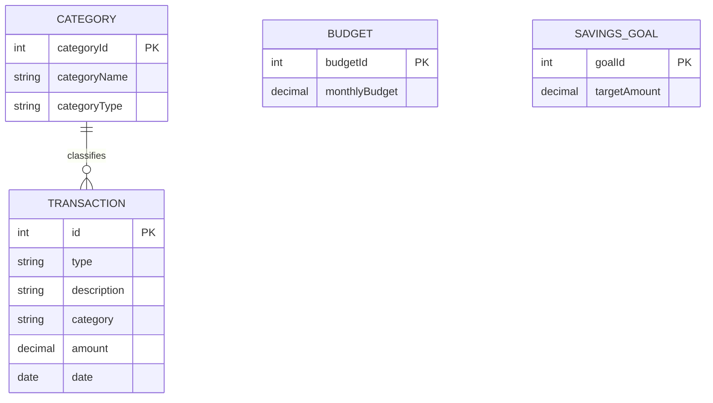

# ER Diagram and Data Model — Budget Planning Application

**Project Name:** Budget Planning Application  
**Document:** Entity Relationship Diagram and Logical Data Model  
**Author:** Ansh Pandey  
**Year:** 2026  
**Technology:** HTML5, CSS3, JavaScript ES6, Browser LocalStorage  
**Version:** 1.0

---

# 1. Introduction

An **Entity Relationship Diagram (ER Diagram)** is a graphical representation of the entities in a system, their attributes, and the relationships between them.

For the Budget Planning Application, the ER model describes the logical structure of financial data maintained by the application.

The current version uses **Browser LocalStorage** instead of a relational database. Therefore, this document represents the application's logical data model and shows how the same information can be organized into entities for future database implementation.

---

# 2. Purpose

The main objectives of this document are:

- To identify the major data entities.
- To define attributes of each entity.
- To identify primary keys.
- To describe relationships between entities.
- To provide a logical representation of application data.
- To support future database migration.
- To maintain consistency between the application's data model and implementation.

---

# 3. Current Data Storage Architecture

The current application stores data inside the browser using LocalStorage.

The main storage structure is conceptually:

```text
budgetPlanningApplication
│
├── transactions[]
│
├── budget
│
└── savingsGoal
```

The `transactions` collection contains multiple income and expense records.

---

# 4. Main Entities

The logical data model contains the following major entities:

1. **Transaction**
2. **Budget**
3. **SavingsGoal**
4. **Category**

These entities represent the major financial information handled by the application.

---

# 5. Entity 1 — Transaction

The **Transaction** entity represents an individual financial transaction.

A transaction may represent either:

- Income
- Expense

## Attributes

| Attribute | Description | Type | Key |
|---|---|---|---|
| id | Unique transaction identifier | String/Number | Primary Key |
| type | Income or Expense | String | — |
| description | Transaction description | String | — |
| category | Transaction category | String | Foreign/Logical Reference |
| amount | Transaction amount | Number | — |
| date | Transaction date | Date/String | — |

### Example

```json
{
  "id": 1,
  "type": "expense",
  "description": "Groceries",
  "category": "Food",
  "amount": 3500,
  "date": "2026-10-01"
}
```

---

# 6. Entity 2 — Budget

The **Budget** entity represents the monthly spending limit configured by the user.

## Attributes

| Attribute | Description | Type | Key |
|---|---|---|---|
| budgetId | Budget identifier | String/Number | Primary Key |
| monthlyBudget | Monthly spending limit | Number | — |

### Example

```json
{
  "budgetId": 1,
  "monthlyBudget": 15000
}
```

The budget is used to calculate:

- Amount spent
- Remaining budget
- Budget utilization
- Budget exceeded status

---

# 7. Entity 3 — SavingsGoal

The **SavingsGoal** entity represents the financial savings target configured by the user.

## Attributes

| Attribute | Description | Type | Key |
|---|---|---|---|
| goalId | Savings goal identifier | String/Number | Primary Key |
| targetAmount | Target savings amount | Number | — |

### Example

```json
{
  "goalId": 1,
  "targetAmount": 10000
}
```

The application uses the target amount to calculate savings progress.

---

# 8. Entity 4 — Category

The **Category** entity represents a logical classification of financial transactions.

Examples include:

```text
Food
Transport
Shopping
Bills
Entertainment
Salary
Other
```

## Attributes

| Attribute | Description | Type | Key |
|---|---|---|---|
| categoryId | Unique category identifier | String/Number | Primary Key |
| categoryName | Name of category | String | — |
| categoryType | Income or Expense category | String | — |

### Example

```json
{
  "categoryId": 1,
  "categoryName": "Food",
  "categoryType": "Expense"
}
```

---

# 9. ER Diagram

The following diagram represents the logical relationship between the major entities.



---

# 10. Relationship Between Category and Transaction

A category can be associated with multiple transactions.

Therefore:

```text
One Category
      │
      │
      ├──── Transaction 1
      ├──── Transaction 2
      ├──── Transaction 3
      └──── Transaction N
```

### Cardinality

**One-to-Many (1:N)**

One category can classify many transactions.

For example:

```text
Food
 │
 ├── Groceries ₹3500
 ├── Restaurant ₹800
 └── Snacks ₹200
```

---

# 11. Budget Relationship

The current application maintains a single active monthly budget.

Conceptually:

```text
Budget
   │
   └── Monthly Budget Amount
             │
             ▼
       Expense Analysis
             │
             ▼
       Budget Utilization
```

In a future multi-user or multi-month database system, the Budget entity could be expanded to contain:

- User ID
- Month
- Year
- Budget category
- Budget amount

---

# 12. Savings Goal Relationship

The current application maintains a savings target.

Conceptually:

```text
Savings Goal
     │
     ▼
Target Amount
     │
     ▼
Current Financial Balance
     │
     ▼
Savings Progress
```

In a future system, multiple savings goals could be supported.

For example:

```text
Savings Goals
│
├── Emergency Fund
├── Laptop
├── Vacation
└── Education
```

---

# 13. Complete Logical Data Relationship

The overall data relationship can be represented as:

```text
                    ┌──────────────┐
                    │   Category   │
                    └──────┬───────┘
                           │
                         1 │
                           │
                         N │
                    ┌──────▼───────┐
                    │  Transaction │
                    └──────────────┘

                    ┌──────────────┐
                    │    Budget    │
                    └──────┬───────┘
                           │
                           ▼
                    Budget Analysis


                    ┌──────────────┐
                    │ Savings Goal │
                    └──────┬───────┘
                           │
                           ▼
                    Savings Analysis
```

---

# 14. Transaction Entity Details

The Transaction entity is the primary financial data entity.

## 14.1 Transaction ID

The `id` uniquely identifies each transaction.

Example:

```text
1
2
3
4
```

No two transactions should have the same identifier.

---

## 14.2 Transaction Type

The `type` attribute identifies whether the transaction represents income or expense.

Allowed values:

```text
income
expense
```

Example:

```text
type = "income"
```

or

```text
type = "expense"
```

---

## 14.3 Description

The `description` field stores a human-readable description.

Examples:

```text
Salary
Groceries
Bus Pass
Electricity Bill
Shopping
```

---

## 14.4 Category

The category identifies the financial classification.

Examples:

```text
Salary
Food
Transport
Bills
Shopping
Entertainment
Other
```

---

## 14.5 Amount

The amount represents the monetary value of the transaction.

Example:

```text
3500
```

The application should accept valid positive monetary values.

---

## 14.6 Date

The date represents when the transaction occurred.

Example:

```text
2026-10-01
```

---

# 15. Logical Schema

The entities can be represented using the following logical schema.

## Transaction

```text
TRANSACTION(
    id PK,
    type,
    description,
    category,
    amount,
    date
)
```

## Category

```text
CATEGORY(
    categoryId PK,
    categoryName,
    categoryType
)
```

## Budget

```text
BUDGET(
    budgetId PK,
    monthlyBudget
)
```

## Savings Goal

```text
SAVINGS_GOAL(
    goalId PK,
    targetAmount
)
```

---

# 16. Data Types

| Attribute | Suggested Data Type | Example |
|---|---|---|
| id | Integer/String | 101 |
| type | String | expense |
| description | String | Groceries |
| category | String | Food |
| amount | Decimal/Number | 3500.00 |
| date | Date/String | 2026-10-01 |
| categoryId | Integer/String | 1 |
| categoryName | String | Food |
| categoryType | String | Expense |
| monthlyBudget | Decimal/Number | 15000.00 |
| targetAmount | Decimal/Number | 10000.00 |

---

# 17. Data Integrity Rules

The application should maintain the following rules:

### Rule 1 — Unique Transaction ID

Every transaction must have a unique identifier.

### Rule 2 — Valid Transaction Type

Transaction type must be either:

```text
income
```

or

```text
expense
```

### Rule 3 — Positive Amount

Transaction amounts should be greater than zero.

### Rule 4 — Valid Date

Every transaction should contain a valid date.

### Rule 5 — Valid Category

A transaction should belong to an appropriate category.

### Rule 6 — Valid Budget

The monthly budget should be a valid positive amount.

### Rule 7 — Valid Savings Goal

The savings goal should be a valid positive amount.

---

# 18. LocalStorage Data Model

Although the logical design is represented using entities, the current implementation stores the information as a JavaScript object.

Conceptually:

```json
{
  "transactions": [
    {
      "id": 1,
      "type": "income",
      "description": "Salary",
      "category": "Salary",
      "amount": 30000,
      "date": "2026-10-01"
    },
    {
      "id": 2,
      "type": "expense",
      "description": "Groceries",
      "category": "Food",
      "amount": 3500,
      "date": "2026-10-02"
    }
  ],
  "budget": 15000,
  "savingsGoal": 10000
}
```

This structure is stored under the application's LocalStorage key.

```text
budgetPlanningApplication
```

---

# 19. Data Operations

The application performs four major operations on transaction data.

## Create

New income or expense transaction is created.

```text
User Input
    ↓
Validation
    ↓
Create Transaction
    ↓
LocalStorage
```

## Read

Stored transaction data is retrieved.

```text
LocalStorage
    ↓
JavaScript
    ↓
Dashboard / Transaction Table
```

## Update

Existing transaction information is modified.

```text
Existing Transaction
        ↓
     Edit Form
        ↓
     Validation
        ↓
     Updated Data
        ↓
     LocalStorage
```

## Delete

A transaction is removed.

```text
Transaction
     ↓
Delete Request
     ↓
Remove Record
     ↓
LocalStorage
```

---

# 20. Relationship With Financial Calculations

The entities support the application's financial calculations.

## Total Income

```text
Total Income
=
Sum of all income transactions
```

## Total Expense

```text
Total Expense
=
Sum of all expense transactions
```

## Current Balance

```text
Balance
=
Total Income - Total Expense
```

## Budget Remaining

```text
Budget Remaining
=
Monthly Budget - Relevant Expenses
```

## Savings Progress

Conceptually:

```text
Savings Progress
=
Current Savings / Savings Goal × 100
```

These calculations are generated dynamically from the stored data.

---

# 21. Category Analysis

The Category and Transaction entities support expense analysis.

Example:

```text
Food
 ├── Groceries     ₹3500
 ├── Restaurant     ₹800
 └── Snacks         ₹200

Total Food Expense = ₹4500
```

This allows the system to identify spending patterns.

---

# 22. Current System vs Future Database

| Feature | Current System | Future System |
|---|---|---|
| Storage | Browser LocalStorage | SQL/NoSQL Database |
| Users | Single local user | Multiple users |
| Authentication | Not available | Authentication system |
| Transactions | Local | Cloud/Server |
| Budget | Local | Database-backed |
| Savings Goals | Local | Database-backed |
| Synchronization | Device/browser dependent | Multi-device |
| Backup | Manual | Server/cloud backup |
| Security | Client-side | Server + database security |

---

# 23. Future Database Design

If the application is converted into a full-stack system, additional entities may be introduced.

Possible future entities:

```text
USER
TRANSACTION
CATEGORY
BUDGET
SAVINGS_GOAL
```

A possible future relationship would be:

```text
USER
 │
 ├───────────────< TRANSACTION
 │
 ├───────────────< BUDGET
 │
 └───────────────< SAVINGS_GOAL

CATEGORY
 │
 └───────────────< TRANSACTION
```

This would allow multiple users to maintain independent financial information.

---

# 24. Normalization Consideration

For a future relational database implementation, the data should be normalized to reduce duplication.

For example, instead of repeatedly storing:

```text
Food
Food
Food
Food
```

a separate Category table can store category information.

The Transaction table can reference the category using `categoryId`.

Example:

```text
CATEGORY
--------------------
categoryId | name
1          | Food
2          | Transport
3          | Bills
```

Transaction:

```text
TRANSACTION
----------------------------
id | categoryId | amount
1  | 1          | 3500
2  | 1          | 800
3  | 2          | 1200
```

This design improves consistency and maintainability.

---

# 25. Data Security Consideration

The current LocalStorage implementation is intended for an academic/client-side application.

LocalStorage should not be considered equivalent to secure server-side storage.

The application should therefore avoid storing:

- Passwords
- Authentication tokens
- Bank credentials
- Credit/debit card information
- Highly sensitive financial credentials

A future full-stack implementation should use:

- Authentication
- Authorization
- HTTPS
- Secure database storage
- Server-side validation
- Appropriate access controls

---

# 26. ER Diagram Validation Checklist

- [x] Major data entities identified.
- [x] Transaction entity defined.
- [x] Budget entity defined.
- [x] Savings Goal entity defined.
- [x] Category entity defined.
- [x] Primary keys identified.
- [x] Transaction attributes defined.
- [x] Category relationship defined.
- [x] Logical data model provided.
- [x] LocalStorage representation documented.
- [x] Data integrity rules documented.
- [x] CRUD operations documented.
- [x] Future database migration considered.

---

# 27. Conclusion

The ER Diagram and Logical Data Model define the structure of information used by the Budget Planning Application.

The **Transaction** entity forms the core of the financial data, while **Category**, **Budget**, and **Savings Goal** support classification and financial planning.

Although the current implementation uses Browser LocalStorage rather than a relational database, the logical model has been designed so that it can be migrated to a database-backed architecture in the future.

This document provides a foundation for understanding the application's data structure and supports future development, testing, database migration, and system maintenance.

---

## Project Information

**Project:** Budget Planning Application  
**Document:** ER Diagram and Logical Data Model  
**Author:** Ansh Pandey  
**Year:** 2026  
**Version:** 1.0  
**Status:** Academic Project
