# Flowchart — Budget Planning Application

**Project Name:** Budget Planning Application  
**Document:** System Flowcharts  
**Author:** Ansh Pandey  
**Year:** 2026  
**Technology:** HTML5, CSS3, JavaScript ES6, Browser LocalStorage  
**Version:** 1.0

---

# 1. Introduction

A **flowchart** is a graphical representation of the sequence of operations performed by a system.

The flowcharts for the Budget Planning Application describe how the application processes user actions such as adding transactions, calculating financial summaries, managing budgets, tracking savings, searching records, and exporting data.

Flowcharts help developers and users understand the logical sequence of operations and decision-making points within the system.

---

# 2. Purpose

The objectives of the flowchart documentation are:

- To represent application workflows visually.
- To describe the sequence of major operations.
- To identify decision points.
- To represent validation and error handling.
- To simplify understanding of application logic.
- To support implementation and testing.

---

# 3. Flowchart Symbols

The following standard flowchart concepts are used:

| Symbol / Concept | Meaning |
|---|---|
| Start / End | Beginning or termination of a process |
| Process | An operation performed by the system |
| Input / Output | Data entered or displayed |
| Decision | Conditional check |
| Arrow | Direction of flow |
| Data Store | Stored application information |

---

# 4. Overall Application Flowchart

The overall application workflow begins when the user opens the application.

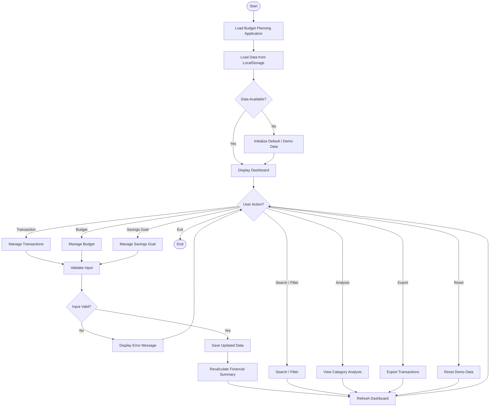

---

# 5. Application Initialization Flowchart

This flowchart describes what happens when the application starts.

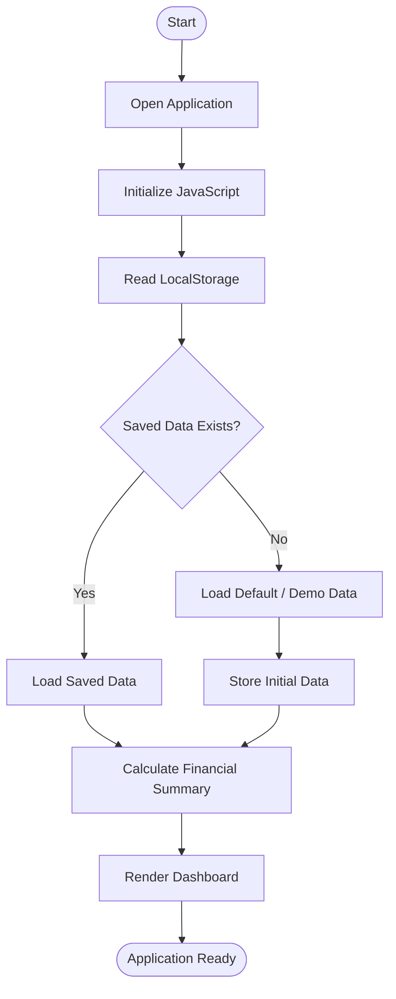

---

# 6. Add Transaction Flowchart

The transaction workflow handles both income and expense records.

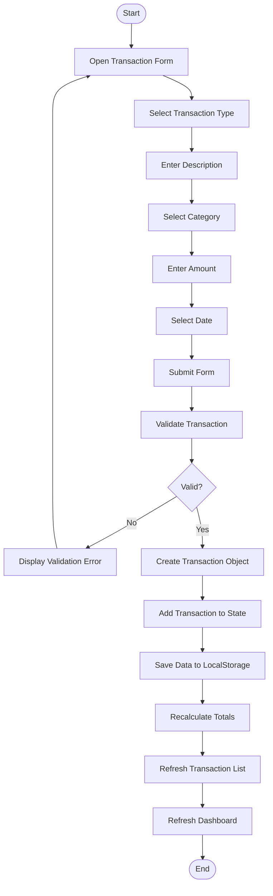

---

# 7. Add Income Flow

Income follows the transaction workflow with the transaction type set to income.

```text
Start
  ↓
Open Transaction Form
  ↓
Select Income
  ↓
Enter Details
  ↓
Validate Data
  ↓
Valid?
 ┌───────────────┐
 │               │
No              Yes
 │               │
 ↓               ↓
Error         Create Income
Message           ↓
 │            Save Data
 │               ↓
 └──────────► Update Dashboard
                  ↓
                 End
```

---

# 8. Add Expense Flow

Expense follows the same general transaction workflow.

```text
Start
  ↓
Open Transaction Form
  ↓
Select Expense
  ↓
Enter Details
  ↓
Validate Data
  ↓
Valid?
 ┌───────────────┐
 │               │
No              Yes
 │               │
 ↓               ↓
Error         Create Expense
Message           ↓
 │            Save Data
 │               ↓
 └──────────► Update Totals
                  ↓
            Update Dashboard
                  ↓
                 End
```

---

# 9. Edit Transaction Flowchart

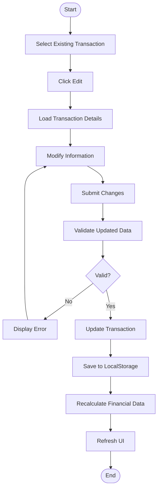

---

# 10. Delete Transaction Flowchart

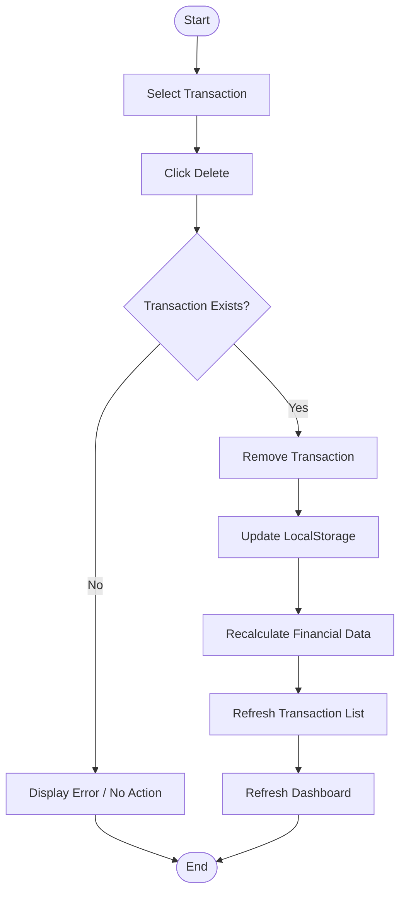

---

# 11. Budget Management Flowchart

The budget workflow allows the user to configure a monthly spending limit.

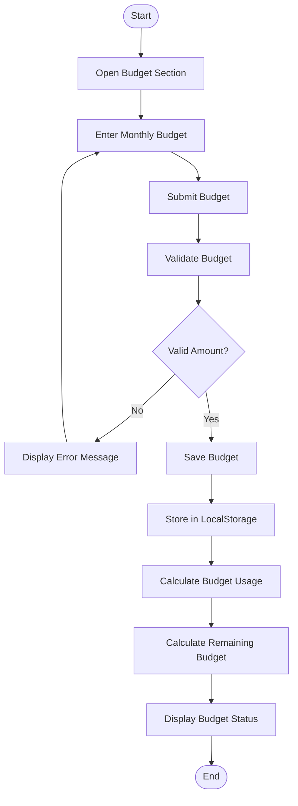

---

# 12. Budget Monitoring Flowchart

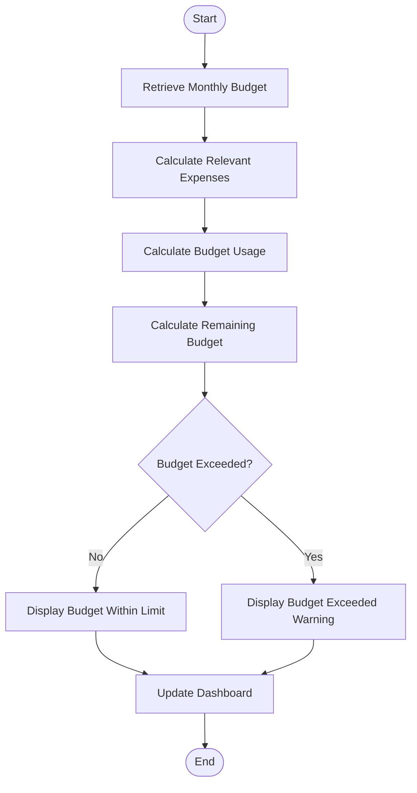

---

# 13. Savings Goal Flowchart

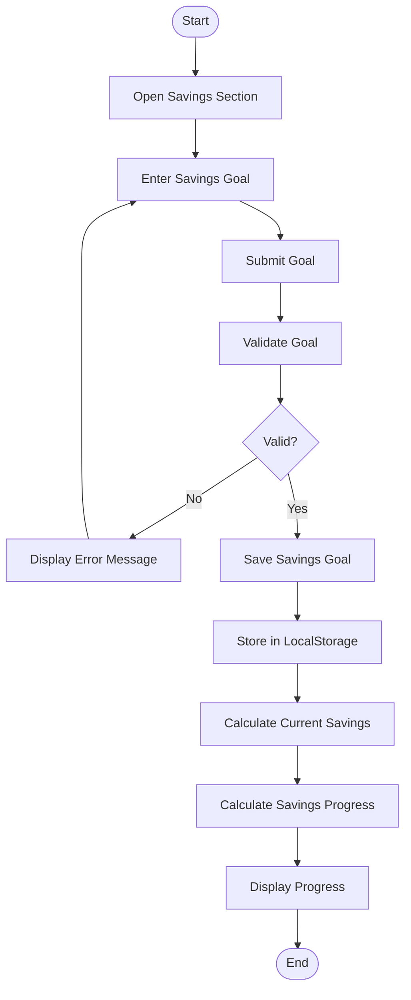

---

# 14. Search Flowchart

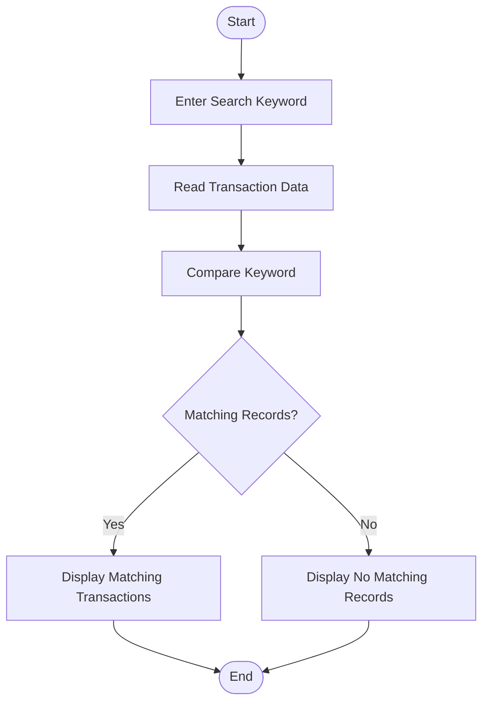

---

# 15. Filter Flowchart

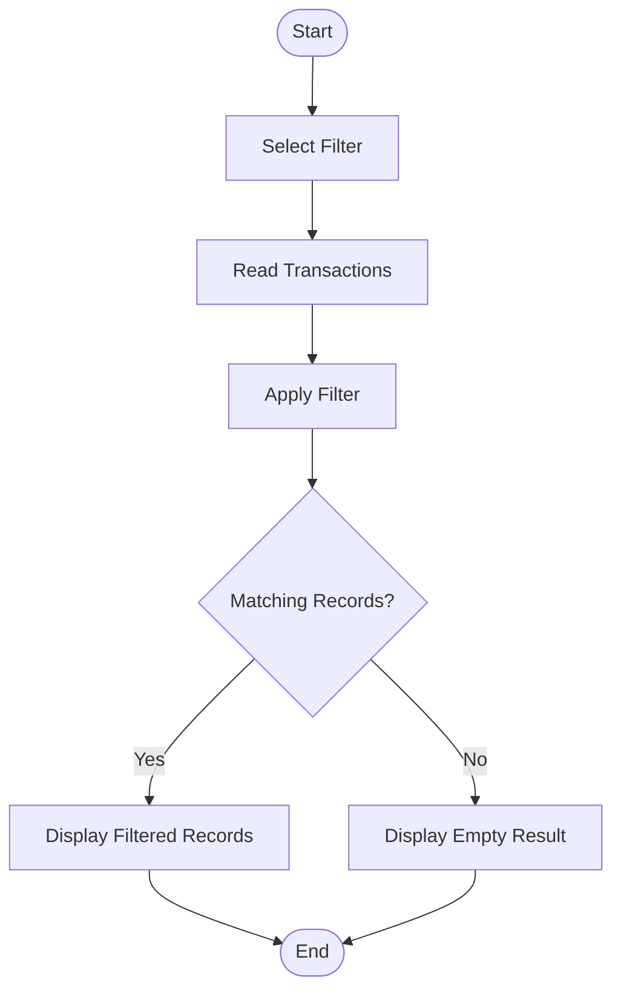

---

# 16. Category Analysis Flowchart

The category analysis process groups expense transactions by category.

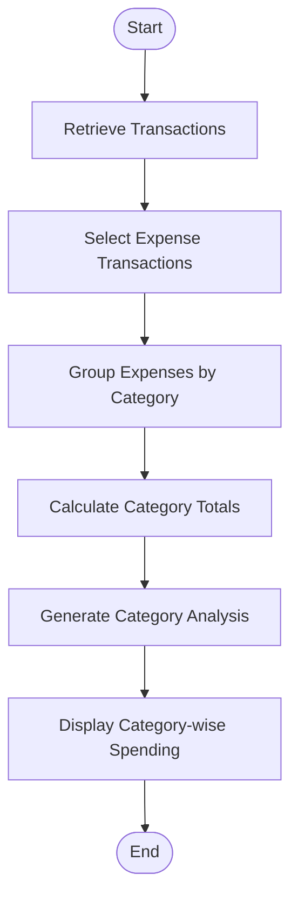

---

# 17. Financial Calculation Flowchart

The dashboard calculations follow this general process:

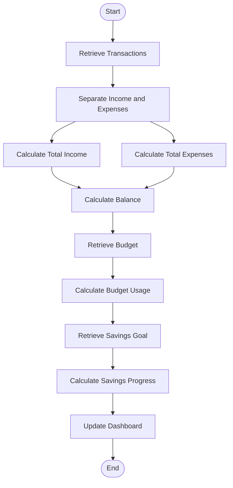

---

# 18. Financial Calculation Logic

## 18.1 Total Income

```text
Total Income = Sum of all Income Transactions
```

## 18.2 Total Expenses

```text
Total Expenses = Sum of all Expense Transactions
```

## 18.3 Current Balance

```text
Current Balance = Total Income - Total Expenses
```

## 18.4 Budget Usage

```text
Budget Usage = Relevant Expenses / Monthly Budget × 100
```

## 18.5 Savings Progress

```text
Savings Progress = Current Savings / Savings Goal × 100
```

The exact calculation may depend on the implementation logic used in `script.js`.

---

# 19. CSV Export Flowchart

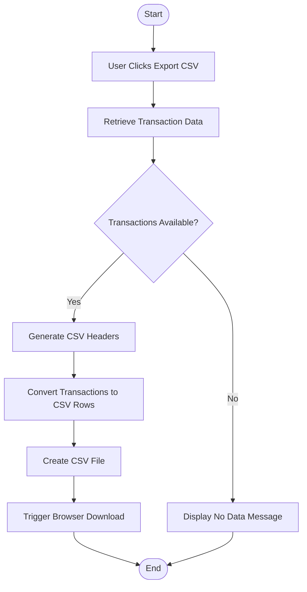

---

# 20. Reset Demo Data Flowchart

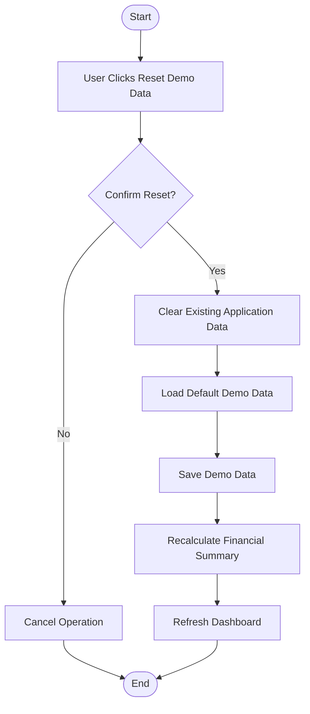

---

# 21. Data Persistence Flowchart

All important application data is persisted using LocalStorage.

```text
User Action
    ↓
Application State Updated
    ↓
Validation
    ↓
Valid?
 ┌─────────────┐
 │             │
No            Yes
 │             │
 ↓             ↓
Error      LocalStorage
Message        ↓
           Data Saved
               ↓
          UI Refreshed
```

---

# 22. Error Handling Flow

The application performs validation before storing user-provided data.

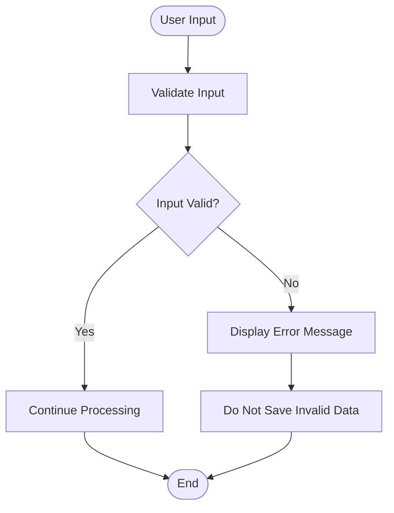

---

# 23. Complete Transaction Lifecycle

The complete lifecycle of a transaction can be represented as:

```text
Create
  ↓
Validate
  ↓
Store
  ↓
Display
  ↓
Search / Filter
  ↓
Edit
  ↓
Validate
  ↓
Store Updated Data
  ↓
Display Updated Data
  ↓
Delete
  ↓
Update Storage
```

---

# 24. Decision Points

The major decision points in the application are:

| Decision | Possible Outcomes |
|---|---|
| Saved data available? | Yes / No |
| Input valid? | Yes / No |
| Transaction exists? | Yes / No |
| Matching search results? | Yes / No |
| Matching filter results? | Yes / No |
| Budget exceeded? | Yes / No |
| Savings goal available? | Yes / No |
| Transactions available for export? | Yes / No |
| Reset confirmed? | Yes / No |

---

# 25. Flowchart Relationship With System Modules

| Flowchart | Related Module |
|---|---|
| Application Initialization | Application Core |
| Add Transaction | Transaction Management |
| Edit Transaction | Transaction Management |
| Delete Transaction | Transaction Management |
| Budget Management | Budget Module |
| Savings Goal | Savings Module |
| Search | Search Module |
| Filter | Filter Module |
| Category Analysis | Analysis Module |
| Financial Calculation | Dashboard Module |
| CSV Export | Export Module |
| Reset Demo Data | Data Management |
| Error Handling | Validation Module |

---

# 26. Flowchart Validation Checklist

- [x] Application startup flow included.
- [x] Transaction flow included.
- [x] Income flow included.
- [x] Expense flow included.
- [x] Edit flow included.
- [x] Delete flow included.
- [x] Budget flow included.
- [x] Savings flow included.
- [x] Search flow included.
- [x] Filter flow included.
- [x] Category analysis flow included.
- [x] Financial calculation flow included.
- [x] CSV export flow included.
- [x] Reset flow included.
- [x] Validation flow included.
- [x] Error handling included.
- [x] Decision points documented.

---

# 27. Conclusion

The flowcharts provide a visual representation of the major workflows of the Budget Planning Application.

They describe how the system initializes, receives user input, validates information, stores data, performs financial calculations, updates the dashboard, and provides outputs to the user.

The flowcharts also cover important decision points and error-handling paths, making them useful for system implementation, debugging, testing, and academic Software Engineering documentation.

---

## Project Information

**Project:** Budget Planning Application  
**Document:** System Flowcharts  
**Author:** Ansh Pandey  
**Year:** 2026  
**Version:** 1.0  
**Status:** Academic Project
