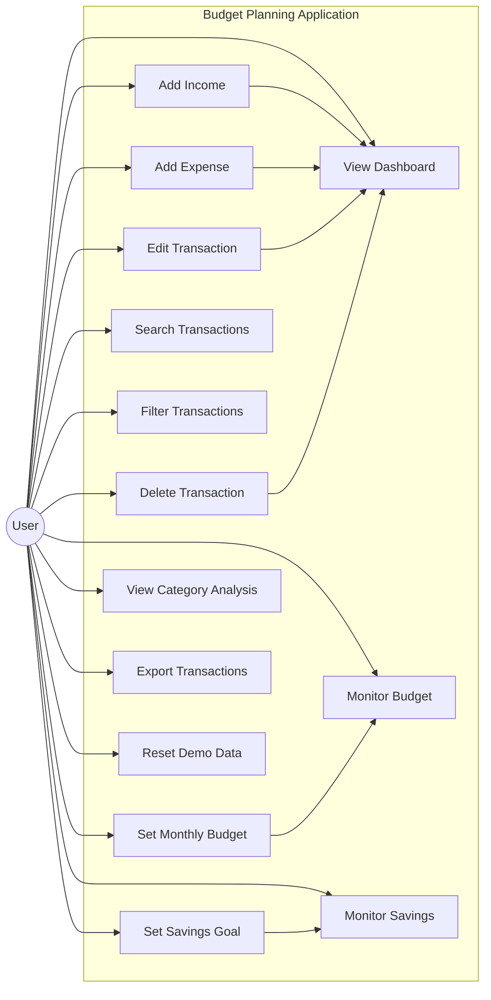

# Use Case Diagram — Budget Planning Application

**Project Name:** Budget Planning Application  
**Document:** Use Case Diagram and Use Case Specification  
**Author:** Ansh Pandey  
**Year:** 2026  
**Technology:** HTML5, CSS3, JavaScript ES6, Browser LocalStorage  

---

## 1. Introduction

The Use Case Diagram describes the interaction between the user and the Budget Planning Application. It identifies the major functionalities provided by the system and shows how the user interacts with those functionalities.

The purpose of this document is to define the functional behavior of the application from the user's point of view.

The Budget Planning Application allows users to manage their income and expenses, define a monthly budget, set a savings goal, analyze spending patterns, search and filter transactions, and export financial records.

---

## 2. Purpose

The main purposes of the Use Case Model are:

- To identify the primary actor of the system.
- To identify major system functionalities.
- To describe how users interact with the application.
- To define the expected behavior of each functionality.
- To provide a foundation for system development and testing.
- To establish traceability between requirements and system functions.

---

## 3. System Actor

### 3.1 Primary Actor — User

The **User** is the primary actor of the Budget Planning Application.

The user can:

- View the financial dashboard.
- Add income records.
- Add expense records.
- Edit existing transactions.
- Delete transactions.
- Search transactions.
- Filter transactions.
- Set a monthly budget.
- Monitor budget usage.
- Set a savings goal.
- Monitor savings progress.
- View category-wise expense analysis.
- Export transaction data.
- Reset demonstration data.

The current version of the application is designed for a single local user and does not require account registration or authentication.

---

# 4. Use Case Overview

The major use cases of the system are:

| ID | Use Case | Actor |
|---|---|---|
| UC-01 | View Dashboard | User |
| UC-02 | Add Income | User |
| UC-03 | Add Expense | User |
| UC-04 | Edit Transaction | User |
| UC-05 | Delete Transaction | User |
| UC-06 | Search Transactions | User |
| UC-07 | Filter Transactions | User |
| UC-08 | Set Monthly Budget | User |
| UC-09 | Monitor Budget | User |
| UC-10 | Set Savings Goal | User |
| UC-11 | Monitor Savings | User |
| UC-12 | View Category Analysis | User |
| UC-13 | Export Transactions | User |
| UC-14 | Reset Demo Data | User |

---

# 5. Use Case Diagram

The following diagram represents the major interactions between the User and the Budget Planning Application.



---

# 6. System Boundary

The system boundary defines which functionality belongs to the Budget Planning Application.

### Inside the System

The following functions are part of the application:

- Dashboard
- Transaction management
- Income management
- Expense management
- Budget management
- Savings goal management
- Search
- Filtering
- Category analysis
- Data export
- LocalStorage persistence
- Demo data reset

### Outside the System

The following are outside the current system:

- Bank account integration
- Online payment processing
- Cloud database
- User authentication
- Multiple user management
- Automatic bank transaction import
- External financial services

---

# 7. Use Case Specifications

## UC-01 — View Dashboard

### Description

The user views the main dashboard containing a summary of their financial information.

### Actor

User

### Preconditions

- The application is loaded successfully.

### Trigger

The user opens the application.

### Main Flow

1. User opens the Budget Planning Application.
2. The system loads saved data from LocalStorage.
3. The system calculates total income.
4. The system calculates total expenses.
5. The system calculates current balance.
6. The system calculates budget usage.
7. The system calculates savings progress.
8. The dashboard displays the updated information.

### Alternative Flow

If no transaction data exists, the system displays zero or default values.

### Postconditions

The latest financial summary is displayed to the user.

---

# 8. UC-02 — Add Income

### Description

The user adds a new income transaction.

### Actor

User

### Preconditions

- The application is running.
- The income form is available.

### Trigger

The user submits an income record.

### Main Flow

1. User opens the transaction form.
2. User selects **Income**.
3. User enters transaction description.
4. User selects a category.
5. User enters the amount.
6. User selects the transaction date.
7. User submits the form.
8. The system validates the input.
9. The system creates a transaction record.
10. The transaction is stored in LocalStorage.
11. The dashboard is updated.

### Alternative Flow

If required information is missing, the system displays a validation message and does not save the transaction.

### Postconditions

A new income transaction is available in the transaction list.

---

# 9. UC-03 — Add Expense

### Description

The user adds a new expense transaction.

### Actor

User

### Preconditions

- The application is running.
- The expense form is available.

### Trigger

The user submits an expense record.

### Main Flow

1. User selects **Expense**.
2. User enters description.
3. User selects an expense category.
4. User enters the amount.
5. User selects the date.
6. User submits the form.
7. The system validates the information.
8. The system creates the expense transaction.
9. The transaction is stored in LocalStorage.
10. The system recalculates financial statistics.
11. The dashboard is updated.

### Alternative Flow

If the amount is invalid or required information is missing, the system displays an error message.

### Postconditions

The expense is added successfully and reflected in the dashboard.

---

# 10. UC-04 — Edit Transaction

### Description

The user modifies an existing income or expense transaction.

### Actor

User

### Preconditions

- At least one transaction exists.

### Trigger

The user selects the **Edit** option for a transaction.

### Main Flow

1. User selects a transaction.
2. User clicks the Edit button.
3. The system loads the existing transaction details.
4. User modifies the required information.
5. User submits the updated information.
6. The system validates the information.
7. The system updates the transaction.
8. Updated data is saved to LocalStorage.
9. Dashboard calculations are refreshed.

### Alternative Flow

If the entered information is invalid, the system displays a validation message.

### Postconditions

The selected transaction contains the updated information.

---

# 11. UC-05 — Delete Transaction

### Description

The user removes an existing transaction.

### Actor

User

### Preconditions

- At least one transaction exists.

### Trigger

The user clicks the Delete button.

### Main Flow

1. User identifies the transaction.
2. User selects Delete.
3. The system removes the transaction.
4. Updated transaction data is saved.
5. Financial totals are recalculated.
6. The transaction list is refreshed.

### Alternative Flow

If the transaction does not exist, no deletion is performed.

### Postconditions

The selected transaction is removed from the application.

---

# 12. UC-06 — Search Transactions

### Description

The user searches for transactions using a keyword.

### Actor

User

### Preconditions

- The application is loaded.

### Trigger

The user enters a search keyword.

### Main Flow

1. User enters a keyword in the search field.
2. The system compares the keyword with transaction information.
3. Matching transactions are identified.
4. Matching transactions are displayed.

### Alternative Flow

If no transaction matches the keyword, the system displays an empty result state.

### Postconditions

Only relevant transactions are displayed.

---

# 13. UC-07 — Filter Transactions

### Description

The user filters transactions based on available criteria.

### Actor

User

### Preconditions

- Transaction records are available.

### Trigger

The user selects a filter.

### Main Flow

1. User selects a filter option.
2. The system reads the selected filter.
3. The system evaluates available transactions.
4. Matching transactions are displayed.
5. Non-matching transactions are hidden.

### Alternative Flow

If no records match the selected filter, the system displays no matching transactions.

### Postconditions

The transaction list contains only records matching the selected criteria.

---

# 14. UC-08 — Set Monthly Budget

### Description

The user defines a monthly spending budget.

### Actor

User

### Preconditions

- The application is loaded.

### Trigger

The user enters a budget amount.

### Main Flow

1. User opens the budget section.
2. User enters the desired monthly budget.
3. User submits the value.
4. The system validates the amount.
5. The system stores the budget value.
6. The system recalculates budget usage.
7. The dashboard displays the updated budget information.

### Alternative Flow

If the entered budget is invalid, the system displays an error message.

### Postconditions

The new monthly budget is stored and used for budget calculations.

---

# 15. UC-09 — Monitor Budget

### Description

The user monitors spending against the configured monthly budget.

### Actor

User

### Preconditions

- A monthly budget has been configured.

### Trigger

The dashboard is displayed or updated.

### Main Flow

1. The system retrieves the configured budget.
2. The system calculates relevant expenses.
3. The system calculates budget usage.
4. The system calculates the remaining budget.
5. The system displays budget progress.

### Alternative Flow

If spending exceeds the configured budget, the application indicates that the budget has been exceeded.

### Postconditions

The user can determine their current budget utilization.

---

# 16. UC-10 — Set Savings Goal

### Description

The user defines a target savings amount.

### Actor

User

### Preconditions

- The application is loaded.

### Trigger

The user enters a savings goal.

### Main Flow

1. User opens the savings goal section.
2. User enters a target amount.
3. User submits the value.
4. The system validates the amount.
5. The system stores the savings goal.
6. The system calculates current savings progress.
7. The dashboard is updated.

### Alternative Flow

If the goal amount is invalid, the system displays a validation message.

### Postconditions

The savings goal is stored and used for progress calculations.

---

# 17. UC-11 — Monitor Savings

### Description

The user monitors progress toward the configured savings goal.

### Actor

User

### Preconditions

- A savings goal exists.

### Trigger

The dashboard is loaded or financial data changes.

### Main Flow

1. The system retrieves the savings goal.
2. The system calculates the current financial balance.
3. The system compares the current savings amount with the target.
4. The system calculates progress.
5. The system displays the savings progress.

### Alternative Flow

If no savings goal has been configured, the system displays the default or empty goal state.

### Postconditions

The user can view their savings progress.

---

# 18. UC-12 — View Category Analysis

### Description

The user views expenses grouped by category.

### Actor

User

### Preconditions

- Expense transactions are available.

### Trigger

The user views the category analysis section.

### Main Flow

1. The system retrieves expense transactions.
2. The system groups expenses by category.
3. The system calculates the total amount for each category.
4. The system displays category-wise spending information.

### Alternative Flow

If no expenses exist, the system displays an empty analysis state.

### Postconditions

The user can identify major spending categories.

---

# 19. UC-13 — Export Transactions

### Description

The user exports transaction records into a CSV file.

### Actor

User

### Preconditions

- The application contains transaction data.

### Trigger

The user selects the **Export CSV** option.

### Main Flow

1. User clicks the Export button.
2. The system retrieves transaction records.
3. The system converts the records into CSV format.
4. The system generates the downloadable file.
5. The browser downloads the file.

### Alternative Flow

If no transaction data exists, the system may generate an empty file or display an appropriate message.

### Postconditions

The transaction data is available as a CSV file.

---

# 20. UC-14 — Reset Demo Data

### Description

The user resets the application to its demonstration/default state.

### Actor

User

### Preconditions

- The application is loaded.

### Trigger

The user selects the Reset Demo Data option.

### Main Flow

1. User clicks the Reset option.
2. The system asks for confirmation if confirmation is implemented.
3. The system removes current application data.
4. Default demonstration data is restored.
5. The dashboard is recalculated.
6. The updated interface is displayed.

### Alternative Flow

If the user cancels the reset operation, existing data remains unchanged.

### Postconditions

The application returns to its predefined demonstration state.

---

# 21. Use Case Relationships

The application contains several logical relationships between use cases.

### 21.1 Dashboard Dependency

Transaction operations affect the dashboard:

```text
Add Income
     │
     └──────> View Dashboard

Add Expense
     │
     └──────> View Dashboard

Edit Transaction
     │
     └──────> View Dashboard

Delete Transaction
     │
     └──────> View Dashboard
```

Whenever transaction data changes, dashboard calculations are updated.

---

### 21.2 Budget Relationship

```text
Set Monthly Budget
        │
        ▼
   Monitor Budget
```

The budget monitoring functionality depends on the configured monthly budget.

---

### 21.3 Savings Relationship

```text
Set Savings Goal
        │
        ▼
   Monitor Savings
```

The savings monitoring functionality uses the configured savings target and current financial data.

---

# 22. Common Validation Behavior

Several use cases require input validation.

The system should validate:

- Required fields.
- Transaction type.
- Transaction amount.
- Date.
- Budget amount.
- Savings goal amount.
- Valid transaction identifiers.

Invalid data should not be stored in LocalStorage.

---

# 23. LocalStorage Interaction

The current application uses browser LocalStorage for persistent storage.

The conceptual storage structure is:

```text
Browser
   │
   ▼
LocalStorage
   │
   └── budgetPlanningApplication
          │
          ├── transactions
          ├── budget
          └── savingsGoal
```

Whenever relevant data is created, modified, or deleted, the application updates LocalStorage.

---

# 24. Use Case Summary

| ID | Use Case | Main Purpose |
|---|---|---|
| UC-01 | View Dashboard | View overall financial summary |
| UC-02 | Add Income | Record income |
| UC-03 | Add Expense | Record expenses |
| UC-04 | Edit Transaction | Modify transaction information |
| UC-05 | Delete Transaction | Remove transaction |
| UC-06 | Search Transactions | Find transactions using keywords |
| UC-07 | Filter Transactions | Display selected transaction types/categories |
| UC-08 | Set Monthly Budget | Define monthly spending limit |
| UC-09 | Monitor Budget | Track spending against budget |
| UC-10 | Set Savings Goal | Define savings target |
| UC-11 | Monitor Savings | Track savings progress |
| UC-12 | View Category Analysis | Analyze category-wise expenses |
| UC-13 | Export Transactions | Download transaction data |
| UC-14 | Reset Demo Data | Restore default demonstration data |

---

# 25. Acceptance Criteria

The Use Case Model is considered successfully implemented when:

1. The user can access the dashboard.
2. The user can add income transactions.
3. The user can add expense transactions.
4. The user can edit existing transactions.
5. The user can delete transactions.
6. The user can search transactions.
7. The user can filter transactions.
8. The user can configure a monthly budget.
9. The user can monitor budget utilization.
10. The user can configure a savings goal.
11. The user can monitor savings progress.
12. The user can view category-wise expense analysis.
13. The user can export transaction data.
14. The user can restore demonstration data.
15. Data changes are persisted using LocalStorage.
16. Invalid input is rejected appropriately.
17. Dashboard calculations reflect the latest transaction data.

---

# 26. Traceability to Functional Requirements

| Use Case | Related Requirement |
|---|---|
| UC-01 | FR-01 Dashboard |
| UC-02 | FR-02 Income Management |
| UC-03 | FR-03 Expense Management |
| UC-04 | FR-04 Transaction Update |
| UC-05 | FR-05 Transaction Deletion |
| UC-06 | FR-06 Search |
| UC-07 | FR-07 Filtering |
| UC-08 | FR-08 Budget Management |
| UC-09 | FR-09 Budget Monitoring |
| UC-10 | FR-10 Savings Goal |
| UC-11 | FR-11 Savings Monitoring |
| UC-12 | FR-12 Category Analysis |
| UC-13 | FR-13 Data Export |
| UC-14 | FR-14 Demo Data Reset |

---

# 27. Conclusion

The Use Case Model provides a clear representation of how the user interacts with the Budget Planning Application.

The model covers the complete functional scope of the current system, including transaction management, financial monitoring, budget planning, savings tracking, analysis, data searching, filtering, exporting, and application reset.

This document can be used as a reference during implementation, testing, system validation, and future development.

---

## Project Information

**Project:** Budget Planning Application  
**Document:** Use Case Diagram and Use Case Specification  
**Author:** Ansh Pandey  
**Year:** 2026  
**Version:** 1.0  
**Status:** Academic Project
